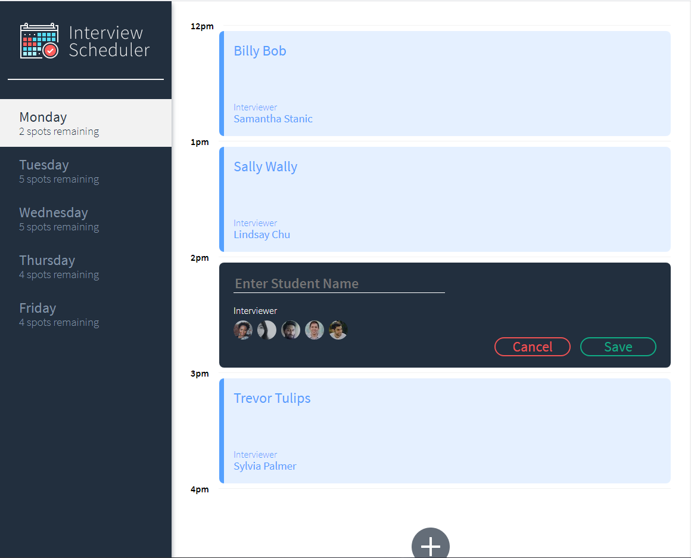

# Interview Scheduler

Scheduler is an intro to React style apps that covers many fundamentals skills. The biggest takeaways I have from Scheduler are working with websockets, axios, state management, passing props, and components.

## Final Product




## Setup

Install dependencies with `npm install`.

## Running Webpack Development Server

```sh
npm start
```

## Running Jest Test Framework

```sh
npm test
```

## Running Storybook Visual Testbed

```sh
npm run storybook
```

## Running Cypress End to End Test Framework
```sh
npm run cypress
```
